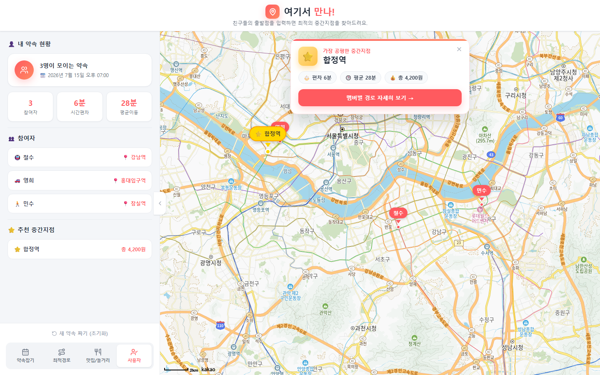
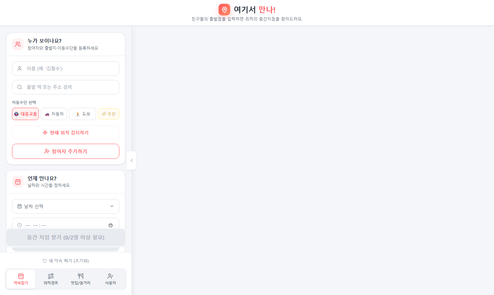
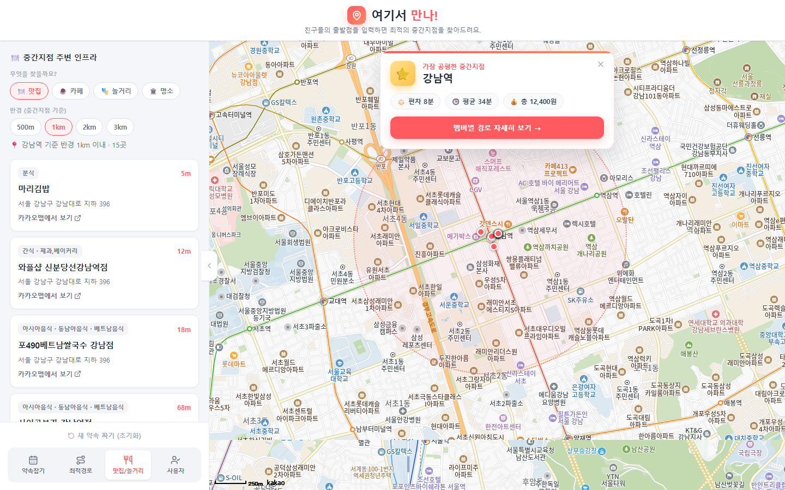

# 여기서 만나! 🗺️

> 친구들의 출발지를 입력하면 **모두에게 가장 공평한 중간지점**을 찾아주고, 그 주변 맛집·놀거리까지 한 번에 보여주는 약속 장소 추천 웹앱

여러 명이 만날 때 "어디서 볼까?"는 늘 애매합니다. 이 서비스는 각자의 출발지·이동수단을 받아 **이동시간의 공평성 + 평균 소요시간 + 교통비**를 함께 계산해, 가장 합리적인 만남 지점을 지도 위에 제안합니다.

<p align="center">
  
</p>

---

## ✨ 주요 기능

| 기능 | 설명 |
|---|---|
| 👥 **참여자 등록** | 이름 + 출발지(카카오 주소검색·현재위치) + 이동수단(대중교통/자동차/도보) |
| 🧮 **공평한 중간지점 계산** | 후보 지점마다 멤버별 경로를 계산해 **공평성·시간·비용**을 가중 점수화 → 최적 지점 선택 |
| 🗺️ **지도 시각화** | 참여자·중간지점 마커, 멤버별 경로선, 전원이 보이도록 자동 축소 |
| ⭐ **결과 배너** | 지도 위에 산출된 장소·편차·평균시간·총교통비를 크게 표시 |
| 🚄 **장거리 대응** | 서울↔부산 같은 도시간은 KTX/고속버스 기준으로 추정(도시내 API 한계 보완) |
| 🍽️ **주변 인프라 검색** | 중간지점 기준 **반경(500m~3km) + 카테고리**로 맛집·카페·놀거리·명소 검색 (지도에 반경 원·마커) |
| 💾 **자동 저장** | localStorage로 새로고침해도 상태·지도 복원 (버전 마이그레이션 포함) |

<p align="center">
  
  
</p>

---

## 🛠 기술 스택

- **React 19** + **TypeScript**
- **Vite** (빌드/개발 서버)
- **Zustand** + `persist` 미들웨어 (전역 상태·localStorage 저장)
- **CSS Modules** + **CSS 변수 디자인 토큰** (색·간격·그림자 일원화)
- **lucide-react** (아이콘)
- **Kakao Maps JS SDK** (지도), **Kakao Local / Mobility REST API** (검색·자동차 경로), **ODsay API** (대중교통 경로)

---

## 🧠 핵심 구현 포인트

- **디자인 시스템**: 모든 색·모서리·그림자를 `global.css`의 CSS 변수 토큰으로 정의 → 한 곳 수정으로 전체 테마 변경, 일관된 UI.
- **명령형 지도 SDK를 React와 통합**: `useImperativeHandle` + `ref`로 마커·경로·반경 원·초기화를 선언형 컴포넌트에서 제어.
- **상태 영속성 + 마이그레이션**: 저장 형식이 바뀌어도 옛 데이터로 앱이 깨지지 않도록 `version` + `migrate`로 안전 처리.
- **중간지점 알고리즘**: 후보별 멤버 경로를 **병렬(`Promise.all`)** 계산 후, 세 지표를 0~1 정규화해 가중 합산 → 단위(분·원)가 달라도 공정 비교.
- **견고한 폴백**: 외부 API 실패 시에도 거리 기반 추정으로 **항상 결과를 보장**(빈 화면 방지).

---

## 🚀 실행 방법

```bash
# 1) 의존성 설치
npm install

# 2) 환경 변수 설정 (.env.example 참고해 .env 생성)
cp .env.example .env
# → 발급받은 카카오/ODsay 키 입력

# 3) 개발 서버 실행
npm run dev   # http://localhost:5173
```

### 필요한 API 키
| 변수 | 발급처 | 용도 |
|---|---|---|
| `VITE_KAKAO_MAP_KEY` | [Kakao Developers](https://developers.kakao.com) (JavaScript 키) | 지도 표시 |
| `VITE_KAKAO_REST_KEY` | Kakao Developers (REST 키) | 주소·장소 검색, 자동차 경로 |
| `VITE_ODSAY_KEY` | [ODsay LAB](https://lab.odsay.com) | 대중교통 경로 |

> ⚠️ 카카오 지도는 [Kakao Developers → 앱 → 플랫폼 → Web]에 도메인(`http://localhost:5173`)을 등록해야 표시됩니다.

---

## 📁 폴더 구조

```
src/
├─ components/
│  ├─ map/KakaoMap.tsx        # 지도 (ref로 마커·경로·반경 제어)
│  ├─ Sidebar.tsx             # 사이드바 프레임·탭·토스트·모달
│  ├─ ResultBanner.tsx        # 지도 위 결과 카드
│  └─ tabs/                   # 약속잡기 / 최적경로 / 주변인프라 / 사용자
├─ lib/midpoint.ts            # 중간지점·경로·비용 계산 알고리즘
├─ store/userStore.ts         # Zustand 전역 상태 (persist)
├─ styles/                    # global.css(토큰) + CSS Modules
└─ pages/Home.tsx             # 레이아웃 조립
```

---

## 📌 알려진 한계 & 향후 계획

- **모바일 반응형**: 현재 데스크톱 레이아웃 위주 → 하단 시트 형태의 모바일 UI 예정
- **공유/협업**: 현재는 한 기기에서 입력 → 약속 링크 공유 + 백엔드(BFF)로 API 키 프록시 계획
- **정확도**: 도시간 대중교통은 추정값 → 공공데이터포털(TAGO 열차·버스) API로 고도화 여지
- **평점**: 카카오 로컬 API는 평점 미제공 → 거리·카테고리·상세링크로 대체
